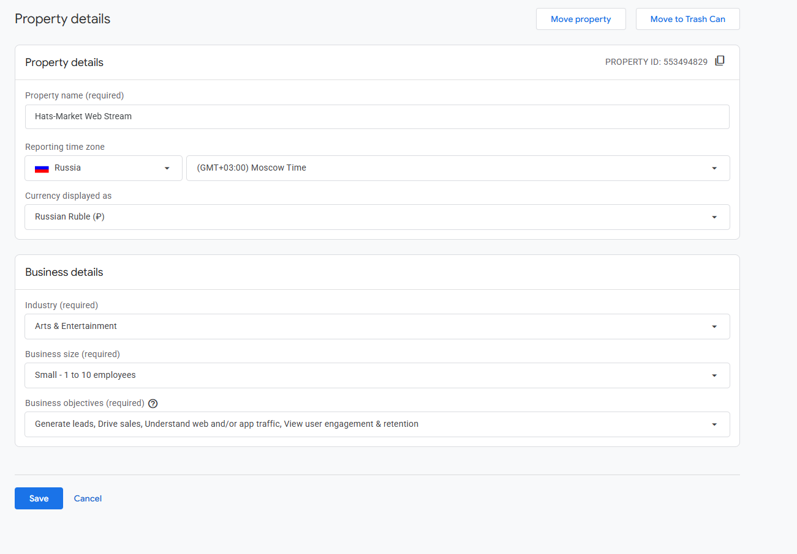
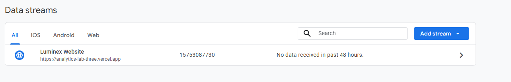
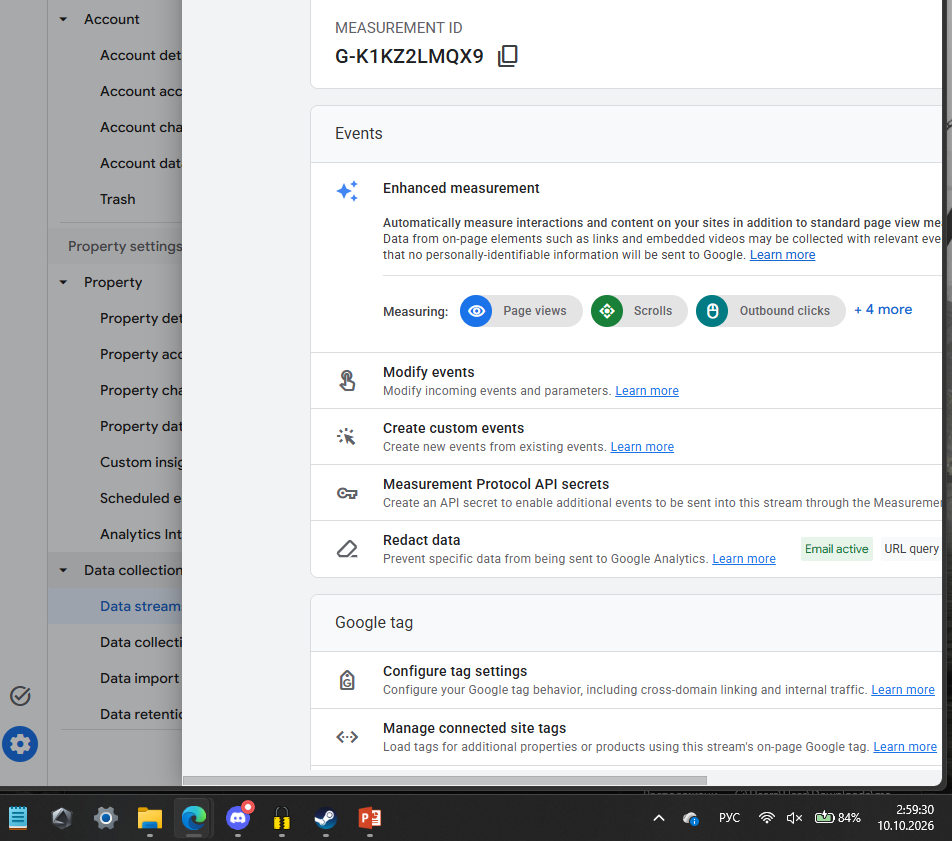

# Домашняя работа № 2 · Где бизнес теряет клиентов

**Дисциплина:** ОП.03 «Информационные технологии»

| Поле | Значение |
|---|---|
| Фамилия, имя, отчество | Геращенко Ксения Игоревна |
| Группа | 9/2-РПО-25/3 |
| Номер работы | 2 |
| Тема работы | Анализ воронки цифрового продукта и структура Google Analytics 4 |
| Дата сдачи | 10.10.2026 |
| Ветка | `hw-02` |

---

# Часть 1. Исследование воронки

## 1.1. Объект исследования

| Поле | Значение |
|---|---|
| Компания, сервис или отрасль | Интернет-магазин меховой фабрики «Венец» (Hats-Market) |
| Адрес сайта или приложения | https://hats-market.ru |
| Целевое действие | Оформление и оплата заказа головного убора |
| Почему выбран этот объект | Российский e-commerce с опубликованным кейсом по оптимизации воронки: есть данные о конверсии, работе с аудиторией и результатах изменений. Подходит для анализа потерь на этапах «реклама → переход → карточка → корзина → заказ» |

## 1.2. Воронка

От 4 до 7 этапов, по порядку.

| № | Этап | Что считается переходом дальше | Метрика этапа |
|---|---|---|---|
| 1 | Показ рекламы (РСЯ, поиск, смарт-баннеры) | Клик по объявлению | CTR (click-through rate) |
| 2 | Переход на сайт / в карточку товара | Просмотр страницы товара | Показатель отказов, глубина просмотра |
| 3 | Просмотр карточки | Добавление товара в корзину | Конверсия в корзину, время на странице |
| 4 | Корзина | Начало оформления заказа | Конверсия из корзины в чекаут |
| 5 | Оформление заказа | Успешная оплата | Конверсия в заказ, доля брошенных корзин |
| 6 | Оплата | Повторная покупка (LTV) | Повторные заказы, средний чек |

## 1.3. Источники

Не менее пяти. Каждый разбирается по пяти пунктам.

### Источник 1

| Поле | Значение |
|---|---|
| Название материала | Как инструменты Яндекса помогли понять свою аудиторию и на 30% увеличить оборот |
| Автор или организация | Яндекс (кейс клиента «Hats-Market») |
| Дата публикации | 17 марта 2025 |
| Прямая ссылка | https://yandex.ru/adv/solutions/cases/hats-market-retargeting |

**Выписка из материала** (ключевая мысль, цифра, наблюдение, результат):

>«После аудита аккаунта настроили корректную работу Метрики, подключили электронную коммерцию и проанализировали портрет ядра аудитории магазина. Оказалось, больше всего заказов через интернет делали женщины старше 45 и старше 55 лет. Сфокусировались на работе с этим сегментом... В результате оборот магазина в сезон вырос на треть относительно аналогичного периода прошлого года, а ретаргетинг помог обеспечить около 20% заказов.»

**Что подтверждает и как связано с моей воронкой** (своими словами):

>Кейс подтверждает, что потери на этапе «реклама → переход на сайт» могут быть связаны с неверным таргетингом: показы шли на широкую аудиторию, тогда как ядро покупателей — женщины 45+. Сужение сегмента и настройка ретаргетинга позволили увеличить оборот на 30% и обеспечить 20% заказов через возврат пользователей

**Цифры из источника и этап воронки, к которому относятся:**

>+30% — рост оборота в сезон (этап: вся воронка, итоговый результат)

>~20% заказов — доля ретаргетинга (этап: возврат пользователей, корзина → заказ)

>конверсия в заказ 4% — на Яндекс.Маркете (этап: карточка → заказ)

### Источник 2

| Поле | Значение |
|---|---|
| Название материала | Как ML-подход удвоил первые покупки при снижении CPI, CAC, ДРР: «Яндекс Маркет» и Bidease |
| Автор или организация | Sostav.ru (кейс Яндекс Маркета и Bidease) |
| Дата публикации | 3 февраля 2026 |
| Прямая ссылка | https://www.sostav.ru/publication/kak-ml-podkhod-udvoil-pervye-81415.html |

**Выписка из материала** (ключевая мысль, цифра, наблюдение, результат):

>«Цель — повысить эффективность и окупаемость перформанс-маркетинга... Важно управлять не просто трафиком, а качеством аудитории. Переходить от "недорогой установки" к "покупающему пользователю".»

**Что подтверждает и как связано с моей воронкой** (своими словами):

>Источник подтверждает проблему потери пользователей на входе в воронку: некачественный трафик (клики ради промокода, случайные установки) не доходит до покупки. ML-оптимизация на целевое действие (первую покупку) позволяет отсеивать нерелевантных пользователей на ранних этапах и фокусироваться на тех, кто дойдёт до заказа.

**Цифры из источника и этап воронки, к которому относятся:**

>удвоение первых покупок — этап: переход → покупка (результат оптимизации)

>снижение CPI, CAC, ДРР — этап: реклама → переход (стоимость привлечения)

### Источник 3

| Поле | Значение |
|---|---|
| Название материала | Как Launcher помог Ozon увеличить число заказов в 46 раз с помощью Smart TV |
| Автор или организация | Sostav.ru (кейс Ozon и Launcher) |
| Дата публикации | 26 марта 2026 |
| Прямая ссылка | https://www.sostav.ru/publication/kak-launcher-pomog-ozon-uvelichit-chislo-zakazov-v-46-raz-s-pomoshchyu-smart-tv-82592.html |

**Выписка из материала** (ключевая мысль, цифра, наблюдение, результат):

>«Средняя длительность сессии: Во время первой кампании пользователи проводили на сайте в среднем около 4 минут. После добавления QR-кода этот показатель вырос до 32 минут.» 

**Что подтверждает и как связано с моей воронкой** (своими словами):

>Кейс показывает, что потери на этапе «реклама → переход → карточка» могут быть связаны с отсутствием прямого пути к товару. Обычный баннер на Smart TV давал отклик, но пользователь не переходил к покупке. Добавление QR-кода с прямой ссылкой на карточку увеличило время сессии с 4 до 32 минут и кратно повысило заказы.

**Цифры из источника и этап воронки, к которому относятся:**

>4 минуты → 32 минуты — средняя длительность сессии (этап: переход → просмотр карточки)

>×46 рост заказов — этап: вся воронка (результат)

>CTR 1,08% → 1,07% — практически не изменился (этап: показ → клик)

### Источник 4

| Поле | Значение |
|---|---|
| Название материала | Женская аудитория Wildberries: как поведение покупателей влияет на SEO и продажи в fashion-категории |
| Автор или организация | Likeni.ru |
| Дата публикации | 19 марта 2026 |
| Прямая ссылка | https://www.likeni.ru/analytics/zhenskaya-auditoriya-wildberries-kak-povedenie-pokupateley-vliyaet-na-seo-i-prodazhi-v-fashion-kateg/ |

**Выписка из материала** (ключевая мысль, цифра, наблюдение, результат):

>«Крупный кадр с читаемым рисунком оказался наиболее эффективным: CTR вырос с 4,2% до 6,0%; добавления в корзину увеличились на 12%... конверсия в покупку выросла на 9%... возвраты снизились с 18% до 14%.»

**Что подтверждает и как связано с моей воронкой** (своими словами):

>Источник подтверждает, что потери происходят на этапе «просмотр карточки → добавление в корзину». Непонятный визуал, отсутствие фото покупателей и видео увеличивают отказы и снижают конверсию. Улучшение карточки (читаемое изображение, отзывы, видео) напрямую влияет на переход к следующему этапу.

**Цифры из источника и этап воронки, к которому относятся:**

>CTR 4,2% → 6,0% — этап: показ → клик (карточка в выдаче)

>+12% добавлений в корзину — этап: просмотр → корзина

>+9% конверсия в покупку — этап: корзина → покупка

>возвраты 18% → 14% — этап: после покупки (LTV)

### Источник 5

| Поле | Значение |
|---|---|
| Название материала | Как оптимизация карточек на Wildberries помогла увеличить конверсию на 15% |
| Автор или организация | Oborot.ru (Алексей Никонов, основатель BRENDOSS) |
| Дата публикации | 19 марта 2025 |
| Прямая ссылка | https://oborot.ru/articles/wildberries-kartochki-keis-29-i238877.html |

**Выписка из материала** (ключевая мысль, цифра, наблюдение, результат):

>«Тепловые карты и данные аналитики показали, что пользователи проводили мало времени на страницах, не доходя до таких ключевых элементов, как описания и отзывы.»

**Что подтверждает и как связано с моей воронкой** (своими словами):

>Источник подтверждает, что на этапе «переход → просмотр карточки → корзина» пользователи уходят, не доходя до важной информации. Оптимизация визуала, описаний и структуры карточки увеличила конверсию на 15%

**Цифры из источника и этап воронки, к которому относятся:**

>+15% конверсия — этап: просмотр карточки → покупка

>62 карточки (80% выручки) — фокус оптимизации (этап: карточка товара)

## 1.4. Реальные кейсы

Не менее двух, российские компании или российский рынок. Каждый разбирается по семи
пунктам. Если показатели не опубликованы, пишется: «точные показатели
в открытом источнике не приведены».

### Кейс 1

| № | Пункт | Ответ |
|---|---|---|
| 1 | Компания, продукт или рынок | Интернет-магазин меховой фабрики «Венец» (Hats-Market), головные уборы |
| 2 | Как выглядела воронка или её проблемный участок | Реклама (РСЯ, поиск) → переход на сайт → карточка товара → корзина → заказ |
| 3 | В чём заключалась проблема | Широкий таргетинг без понимания ядра аудитории; неоптимальная структура рекламных кампаний; недостаточная работа с возвратом пользователей |
| 4 | Какие данные или наблюдения подтвердили проблему | Анализ Метрики и электронной коммерции показал, что основная аудитория — женщины 45+; часть трафика не конвертировалась из-за нерелевантных показов |
| 5 | Что изменили или протестировали | Настроили корректную Метрику, подключили e-commerce, проанализировали портрет ядра, сфокусировались на сегменте 45+, проработали сценарии ретаргетинга, настроили смарт-баннеры |
| 6 | Как изменился результат | Оборот вырос на 30% в сезон; ретаргетинг обеспечил около 20% заказов |
| 7 | Переносим ли подход на мой объект | Да: для интернет-магазина головных уборов важно точно определить ядро аудитории (женщины 45+) и использовать ретаргетинг для возврата тех, кто добавил товар в корзину, но не завершил заказ |

**Ссылка на источник кейса:**

>https://yandex.ru/adv/solutions/cases/hats-market-retargeting

### Кейс 2

| № | Пункт | Ответ |
|---|---|---|
| 1 | Компания, продукт или рынок | Ozon, маркетплейс, продвижение через Smart TV |
| 2 | Как выглядела воронка или её проблемный участок | Показ баннера на Smart TV → переход на сайт → карточка товара → корзина → заказ |
| 3 | В чём заключалась проблема | Стандартный баннер привлекал внимание, но не вёл пользователя к конкретному товару; сессия была короткой (4 минуты), заказов мало |
| 4 | Какие данные или наблюдения подтвердили проблему | Замеры длительности сессии и глубины просмотра показали, что пользователи после клика быстро уходили |
| 5 | Что изменили или протестировали | Добавили QR-код на баннер, ведущий напрямую на карточку конкретного товара |
| 6 | Как изменился результат | Средняя длительность сессии выросла с 4 до 32 минут; число заказов выросло в 46 раз |
| 7 | Переносим ли подход на мой объект | Да: прямая ссылка на конкретный товар в рекламе (вместо общей страницы) сокращает путь и увеличивает вероятность покупки. Для Hats-Market это означает использование смарт-баннеров с привязкой к конкретным моделям головных уборов |

**Ссылка на источник кейса:**

>https://www.sostav.ru/publication/kak-launcher-pomog-ozon-uvelichit-chislo-zakazov-v-46-raz-s-pomoshchyu-smart-tv-82592.html

## 1.5. Причины потери пользователей

Не менее трёх. Каждая опирается на найденные материалы.

| № | Этап воронки | Причина потери | Какой источник это подтверждает |
|---|---|---|---|
| 1 | Реклама → переход | Неверный таргетинг: показы на нерелевантную аудиторию, которая не заинтересована в товаре | Источник 1 (Hats-Market: сфокусировались на женщинах 45+ и оборот вырос на 30%) |
| 2 | Переход → просмотр карточки | Реклама ведёт на общую страницу, а не на конкретный товар; пользователь не находит нужное и уходит | Источник 3 (Ozon: QR-код на конкретную карточку увеличил сессию с 4 до 32 минут)  |
| 3 | Просмотр карточки → корзина | Непонятный визуал, отсутствие отзывов с фото, нет видео — пользователь не уверен в товаре | Источник 4 (Wildberries: крупный кадр + отзывы + видео дали +12% в корзину) |
| 4 | Корзина → заказ | Итоговая цена с доставкой выше ожидаемой; сложное оформление | Источник 5 (Wildberries: работа с карточкой дала +15% конверсии) |

## 1.6. Гипотезы улучшения

Не менее трёх, собственные.

| № | Этап | Гипотеза | Какие данные нужно собрать | Как проверить, сработало |
|---|---|---|---|---|
| 1 | Реклама → переход | Сужение таргетинга на женщин 45+ (ядро аудитории Hats-Market) снизит стоимость привлечения и увеличит конверсию в заказ | Возраст, пол, гео; CTR и CR по сегментам; стоимость заказа | A/B-тест: кампания на широкую аудиторию vs. кампания на сегмент 45+. Сравнить CR и CPA |
| 2 | Переход → просмотр карточки | Прямая ссылка из рекламы на карточку конкретного товара (вместо главной) увеличит глубину просмотра и время на сайте | Глубина просмотра, время на сайте, bounce rate по источникам трафика | Запустить рекламу с прямой ссылкой на карточку и сравнить с рекламой на главную. Метрики: время сессии, CR в корзину |
| 3 | Просмотр карточки → корзина | Добавление видео (10–15 сек) и фото покупателей в карточки головных уборов увеличит добавления в корзину и снизит возвраты | CTR карточки, добавления в корзину, конверсия в покупку, доля возвратов | A/B-тест: часть карточек с видео и отзывами, часть — без. Сравнить CR в корзину и % возвратов |

---

# Часть 2. Google Analytics 4

## 2.1. Пройденные шаги

| № | Шаг | Выполнено |
|---|---|---|
| 1 | Вход в Google Analytics под своим аккаунтом | да |
| 2 | Создан Analytics Account | да |
| 3 | Создан Property | да |
| 4 | Выбраны часовой пояс, валюта и общие сведения | да |
| 5 | Выбраны бизнес-цели | да |
| 6 | Создан ресурс | да |
| 7 | Создан Web Data Stream | да |
| 8 | Проверены Website URL, Stream name, Enhanced Measurement | да |
| 9 | Поток создан | да |
| 10 | Найден Measurement ID | да |

## 2.2. Что получилось

| Поле | Значение |
|---|---|
| Analytics Account | Hats-Market Analytics |
| Property | Hats-Market Website |
| Reporting time zone | (UTC+03:00) Moscow |
| Currency | Russian Ruble (RUB) |
| Выбранные бизнес-цели | Generate leads, Examine user behavior |
| Stream name | Hats-Market Web Stream |
| Website URL | https://hats-market.ru |
| Stream ID (числовой) |  |
| Measurement ID (`G-…`) |  |
| Enhanced Measurement | включено |

Stream ID и Measurement ID — это разные идентификаторы. На сайт в задании 3
ставится второй, вида `G-XXXXXXXXXX`.

## 2.3. Скриншоты

---

## Использование ИИ

Источники вы ищете, читаете и проверяете сами, настройку проходите тоже
сами. ИИ допускается для поиска идей, структурирования и проверки
формулировок, но источником он не считается.

| Вопрос | Ответ |
|---|---|
| Что сделано самостоятельно | мысли, оформление |
| Что спрошено у модели | ответы, подсказки |
| Что после этого проверено и изменено | оформление, свои мысли |
